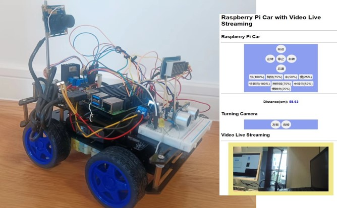

# 红外和Web控制的树莓派视屏小车



## 功能

* 红外和Web控制树莓派小车运动
* Web控制摄像头左右转动

## 元器件

* 树莓派：4B 1个
* 电机驱动模块：LN298N 1个
* 超声模块：HC-SR04 1个
* 红外接收器：VS1838B 1个
  * 红外遥控器：ZTE中国电信IPTV网络/宽带电视机顶盒
* 电阻：220欧，2个，470欧，330欧各1个
* LED: 2个
* USB摄像头： 1个
* 数码管: TM1637 4位数码管 1个
* 步进电机：28BYJ-48 1个
* 步进电机驱动：ULN2003 1个
* 铜质连轴器：4-5mm 2个
* 刚轴： 4*100mm 1个
* 面包板：400孔，1个
* 双层4WD小车底盘：1个(含4个TT电机)
* 电池： 3*18650电池组（电池盒，开关）
* 降压稳压电源模块: DC-DC,9V/12V/24V/36V转5V、3A、双USB输出 1个
* Type-C USB电源线：1根
* 铜柱：M3，若干
* 螺丝、螺母：M3，若干
* 面包板线，杜邦线若干

## Layout

### GPIO of Raspberry Pi


### 400面包板

* Yellow LEDs s2
* 电阻：220欧x2,330Ω,4700Ω
* 红外接收器：VS1838B 
* 超声模块：HC-SR04

|  400面包板 |                         |
|-----------|-------------------------|
| +         |  Pi Board Pin2(+5)  红色 |
| -         |  L298N GND            黑色   |
| -         |  Pi Board Pin39(GND)  黑色  |

### LEDS


| Left LED  |                 |
|-----------|-----------------|
| +         | 220Ω -> Board 7 白色 |
| -         | Breadboard GND |

| Right LED  |                  |
|------------|------------------|
| +          | 220Ω -> Board 40 白色 |
| -          | Breadboard GND |

### 超声模块：HC-SR04


|HC-SR04      |                 |
|-------------|-----------------|
| VCC         | Breadboard +5V  |
| Trigger     | BCM GPIO 6   黄色   |
| Echo        | 330Ω -> BCM GPIO 5 蓝色 -> 470Ω |
| GND         | Breadboard GND  |


### 红外接收器：VS1838B 

使用的GPIO(irremote 32 gpio12)信息配置在系统`/boot/config.txt`中


| VS1838B      |                 |
|-------------|-----------------|
| VCC         | Breadboard +5V  |
| GND         | Breadboard GND  |
| OUT         | BCM GPIO 12 紫色 |

### L298N


**连接Pi**

| L298N       |  Pi         |
|-------------|-----------|
| ENA         | board 22 `GPIO25` 红色 |
| IN1         | board 11 黄色 |
| IN2         | board 12 蓝色 |
| IN3         | board 13 绿色 |
| IN4         | board 15 橙色 |
| ENB         | board 18 `GPIO24` 红色|

**连接电机**

| L298N       |  Motor     |
|-------------|------------|
| Out1        | Left Motor - |
| Out2        | Left Motor + |
| Out3        | Right motor -  |
| Out4        | Right motor +  |

**连接电源**

| L298N       |              |
|-------------|--------------|
| +12V        | 16850电池组 + |
| GND         | 16850电池组 - |
| +5V         | 空            |


### 步进电机驱动

**连接树莓派**

| ULN2003  |  Raspberry Pi |
|----------|---------------|
| IN1      | 37  # GPIO 26 |
| IN2      | 36  # GPIO 16 |
| IN3      | 26  # GPIO 7  |
| IN4      | 24  # GPIO 8  |

**连接电源**

| ULN2003  | 面包板  |
|----------|---------|
| +        |  +      |
| -        |  -      |


### 降压稳压电源模块

* 3*18650电池组 -> 降压稳压电源模块 -> Type-C USB树莓派
* 3*18650电池组 -> LN298


## TM1637 4位数码管

| M1637 | RaspPi  |
|-------|---------|
| CLK   | GPIO 1  |
| DIO   | GPIO 0 |


### 实物连线


## 设备连线汇总

### 设备和树莓派

* LED: 
  * LEFT_LED = 7  # gpio 7
  * RIGHT_LED = 40   # gpio 21

* irremote
   *  32 gpio12 (配置在Linux系统设备中)

* ultrasonic
  * TRIGGER = 31  # GPIO 6
  * ECHO = 29   # GPIO 5

* 400 Breadboard
  * +5 -> 4 +5V 
  * GND -> 39 ground

* L298N Motor Driver
  * Left_Black = 13  # IN3 -> GPIO 27
  * Left_Red = 15    # IN4  -> GPIO 22
  
  * Right_Black = 11  # IN1  ->GPIO17
  * Right_Red = 12     # IN2  -> GPIO 18 PCM_CLK
        
  * Left_Enable = 18     # ENA  -> GPIO 24 PCM_CLK
    Right_Enable = 22     # ENB  -> GPIO 25 PCM_CLK

*  给电机供电3*18650电池组
   * L298N +12V -> 3*18650电池组 +
   * L298N GND -> 3*18650电池组 GND

* ULN2003步进电机驱动
   *  IN1  37  # GPIO 26 
   *  IN2  36  # GPIO 16 
   *  IN3  26  # GPIO 7  
   *  IN4  24  # GPIO 8  

* TM1637 4位数码管
   CLK GPIO 1  pin28
   DIO GPIO 0  Pin27

*  给树莓派供电3*118650电池组 
   * DC-DC稳压降压模块 -，Type-c USB 
  
### 树莓派连线汇总    

* 4 ->   面包板电源 红色线
* 7 ->  面包板上同侧led + 白色线

* 11 -> LN298 IN1 黄色线
* 12 -> LN298 IN2 蓝色线
* 13 -> LN298 IN3 绿色线
* 15 -> LN298 IN4 橙色线

* 18 -> LN298 ENB（3,4） 红色线
* 22 -> LN298 ENA（1,2） 红色线

* 27 ->  TM1637  DIO
* 28 ->  TM1637  CLK

* 29 ->  超声 echo 蓝色线（分压电阻中）
* 31 ->  超声 trigger 黄色线

* 32 ->   红外out  紫色线

* 39 -> 面包板 GND 黑色线
* 40 -> 面包板上同侧led + 白色线

*  37 -> ULN2003步进电机驱动 IN1  GPIO 26 
*  36 -> ULN2003步进电机驱动 IN2  GPIO 16 
*  26 -> ULN2003步进电机驱动 IN3  GPIO 7  
*  24 -> ULN2003步进电机驱动 IN4  GPIO 8  

### 电机驱动和面包板

* LN298 GND -> 面包板 GND 
* ULN2003步进电机驱动 + -> 面包板 + 
* ULN2003步进电机驱动 - -> 面包板 - 

## 软件包

* 红外
```bash
sudo apt-get install ir-keytable
sudo pip3 install evdev
sudo apt-get install evtest
```

* USB摄像头
```bash
sudo apt-get install libopencv-dev
sudo apt-get install python3-opencv
```

* Flask框架

```bash
sudo pip3 install -U Flask
```

## 配置红外

Edit the Raspberry Pi config file:

```bash
sudo nano /boot/config.txt
```
Uncomment this to enable infrared communication. Change the pin to suit your configuration if required.

```bash
dtoverlay=gpio-ir,gpio_pin=12
```   
Reboot when finished:

```bash
sudo reboot
```

## 配置小车webapp为开机运行

* 配置源码为所有用户可执行权限，终端执行

```bash
sudo chmod 777 ./webapp/app_car.py 
```

树莓派开机启动命令位于`/etc/rc.local`中

```bash
sudo nano /etc/rc.local
```

在`rc.local`中加如下命令代码,驱动红外设备，运行webapp

```bash
sudo ir-keytable -p all 
/home/your_user_name/.local/bin/flask --app ./webapp/app_car run --host=0.0.0.0 &
sudo ir-keytable -p all 
```
